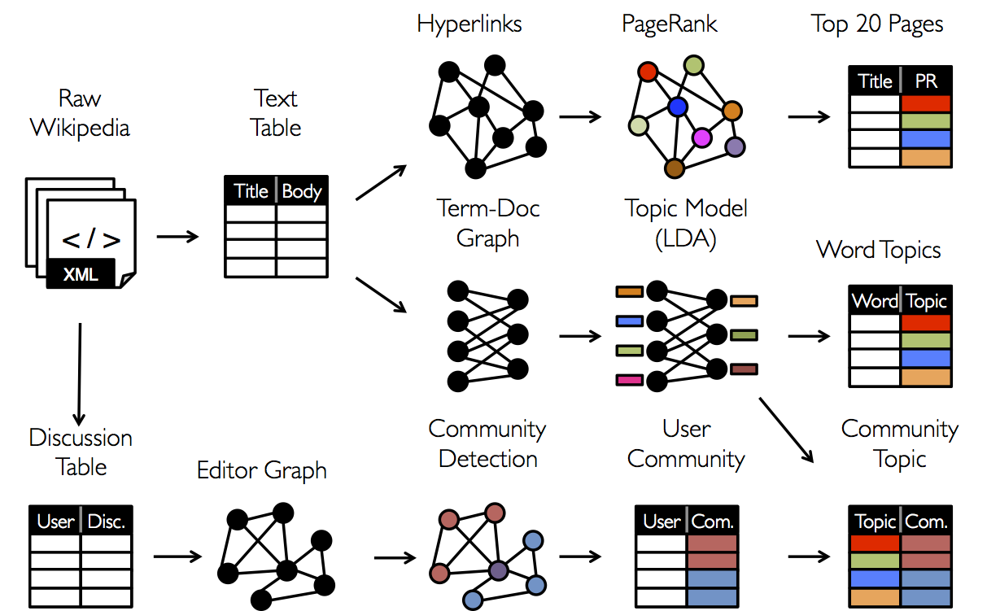
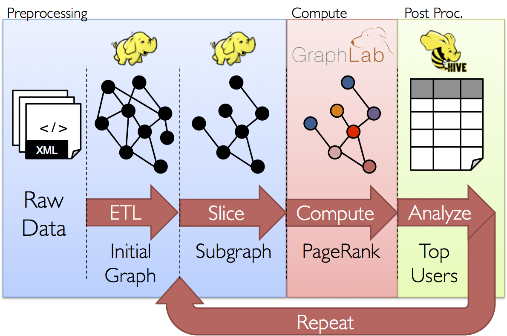

<p style="text-align: center;">
  
  <!-- Images are downsized intentionally to improve quality on retina displays -->
</p>

<!-- In this chapter we use GraphX to analyze Wikipedia data and implement graph algorithms in Spark. As with other exercises we will work with a subset of the Wikipedia traffic statistics data from May 5-7, 2009. In particular, this dataset only includes a subset of all Wikipedia articles. -->

<!---
GraphX is the new Spark API for graphs (e.g., Web-Graphs and Social Networks) and graph-parallel computation (e.g., PageRank and Collaborative Filtering).
At a high-level, GraphX extends the Spark RDD abstraction by introducing the [Resilient Distributed Property Graph](#property_graph): a directed multigraph with properties attached to each vertex and edge.
To support graph computation, GraphX exposes a set of fundamental operators (e.g., [subgraph](#structural_operators), [joinVertices](#join_operators), and [mapReduceTriplets](#mrTriplets)) as well as an optimized variant of the [Pregel](#pregel) API.
In addition, GraphX includes a growing collection of graph [algorithms](#graph_algorithms) and
[builders](#graph_builders) to simplify graph analytics tasks.

In this chapter we use GraphX to analyze Wikipedia data and implement graph algorithms in Spark.
The GraphX API is currently only available in Scala but we plan to provide Java and Python bindings in the future.
-->

## Background on Graph-Parallel Computation (Optional)

If you want to get started coding right away, you can skip this part or come back later.

From social networks to language modeling, the growing scale and importance of graph data has driven the development of numerous new *graph-parallel* systems (e.g., [Giraph](http://giraph.apache.org) and [GraphLab](http://graphlab.org)).
By restricting the types of computation that can be expressed and introducing new techniques to partition and distribute graphs, these systems can efficiently execute sophisticated graph algorithms orders of magnitude faster than more general *data-parallel* systems.

<p style="text-align: center;">
  
  <!-- Images are downsized intentionally to improve quality on retina displays -->
</p>

The same restrictions that enable graph-parallel systems to achieve substantial performance gains also limit their ability to express many of the important stages in a typical graph-analytics pipeline.
Moreover while graph-parallel systems are optimized for iterative diffusion algorithms like PageRank they are not well suited to more basic tasks like constructing the graph, modifying its structure, or expressing computation that spans multiple graphs.

These tasks typically require data-movement outside of the graph topology and are often more naturally expressed as operations on tables in more traditional data-parallel systems like Map-Reduce.
Furthermore, how we look at data depends on our objectives and the same raw data may require many different table and graph views throughout the analysis process:

<p style="text-align: center;">
  
  <!-- Images are downsized intentionally to improve quality on retina displays -->
</p>

Moreover, it is often desirable to be able to move between table and graph views of the same physical data and to leverage the properties of each view to easily and efficiently express
computation.
However, existing graph analytics pipelines compose graph-parallel and data-parallel systems, leading to extensive data movement and duplication and a complicated programming
model.

<p style="text-align: center;">
  
  <!-- Images are downsized intentionally to improve quality on retina displays -->
</p>

The goal of the GraphX project is to unify graph-parallel and data-parallel computation in one system with a single composable API.
The GraphX API enables users to view data both as graphs and as collections (i.e., RDDs) without data movement or duplication. By incorporating recent advances in graph-parallel systems, GraphX is able to optimize the execution of graph operations.

<!---
Prior to the release of GraphX, graph computation in Spark was expressed using Bagel, an implementation of Pregel.
GraphX improves upon Bagel by exposing a richer property graph API, a more streamlined version of the Pregel abstraction, and system optimizations to improve performance and reduce memory overhead.
While we plan to eventually deprecate Bagel, we will continue to support the [Bagel API](api/bagel/index.html#org.apache.spark.bagel.package) and [Bagel programming guide](bagel-programming-guide.html).
However, we encourage Bagel users to explore the new GraphX API and comment on issues that may complicate the transition from Bagel.
-->


## Exercise 1: Introduction to the GraphX API

Because GraphX is a new addition to Spark, there is no Python API for it yet. This means you need to program in Scala to use GraphX.

We will be using the Spark shell for this assignment, which is a modified Scala REPL (Read-Eval-Print Loop). You will be running Spark locally on your laptop for this assignment.

If you have never programmed in Scala before, we recommend working through these [exercises](http://ampcamp.berkeley.edu/big-data-mini-course/introduction-to-the-scala-shell.html) as a gentle introduction to Scala in a REPL.

__Note__: There are some exercises in this lab that require you to write code in the Spark shell. We recommend that you use a text-editor to write the code, and then once you think you have it working copy and paste it into the shell. This way, if you have a syntax error or something goes wrong (e.g. you accidentally exit the shell), you will have all your work saved.

Before you start Spark, there are a few settings to update.

In the `lab10/` directory of the GitHub repository for the class there are two files, `spark-env.sh` and `log4j.properties`. Copy these two files into the the `/conf` subdirectory of your Spark installation.

For example, if the root of my Spark directory is `/home/saasbook/spark-0.9.1-bin-cdh4`, I would do:

```bash
cp /home/saasbook/datascience-labs/lab10/{spark-env.sh,log4j.properties} /home/saasbook/spark-0.9.1-bin-cdh4/conf/
```

The `log4j.properties` file changes the default logging setting from `INFO` to `WARN`, which will remove some of the more verbose Spark logging messages. The `spark-env.sh` file specifies a custom serializer for Spark to use and some additional settings for serialization. These are necessary for GraphX to properly serialize and deserialize its data structures.

Now we can get started. First, start the Spark shell by running the following command from the root of your Spark directory:

```bash
./bin/spark-shell
```

The rest of the commands should be run directly in the Spark shell. First, import the GraphX packages. The `._` at the end of the import statement is a wildcard that tells Scala to import everything in that package, similar to `.*` in Java.

```scala
import org.apache.spark.graphx._
import org.apache.spark.graphx.lib._
import org.apache.spark.rdd.RDD
```

Great! You have now "installed" GraphX.

### The Property Graph
<a name="property_graph"></a>

[PropertyGraph]: http://spark.apache.org/docs/latest/api/graphx/index.html#org.apache.spark.graphx.Graph

The [property graph](PropertyGraph) is a directed multigraph with properties attached to each vertex and edge.
A directed multigraph is a directed graph with potentially multiple parallel edges sharing the same source and destination vertex.
The ability to support parallel edges simplifies modeling scenarios where multiple relationships (e.g., co-worker and friend) can appear between the same vertices.
Each vertex is keyed by a *unique* 64-bit long identifier (`VertexID`).
Similarly, edges have corresponding source and destination vertex identifiers.
The properties are stored as Scala/Java objects with each edge and vertex in the graph.

Throughout the first half of this lab we will use the following toy property graph.
While this is hardly <i>big data</i>, it provides an opportunity to learn about the graph data model and the GraphX API.  In this example we have a small social network with users and their ages modeled as vertices and likes modeled as directed edges.  In this fictional scenario users can like other users multiple times.


<p style="text-align: center;">
  
  <!-- Images are downsized intentionally to improve quality on retina displays -->
</p>

We begin by creating the property graph from arrays of vertices and edges.
Later we will demonstrate how to load real data.
Paste the following code into the shell.

```scala
val vertexArray = Array(
  (1L, ("Alice", 28)),
  (2L, ("Bob", 27)),
  (3L, ("Charlie", 65)),
  (4L, ("David", 42)),
  (5L, ("Ed", 55)),
  (6L, ("Fran", 50))
  )
val edgeArray = Array(
  Edge(2L, 1L, 7),
  Edge(2L, 4L, 2),
  Edge(3L, 2L, 4),
  Edge(3L, 6L, 3),
  Edge(4L, 1L, 1),
  Edge(5L, 2L, 2),
  Edge(5L, 3L, 8),
  Edge(5L, 6L, 3)
  )
```

In the above example we make use of the `Edge` class. Edges have a `srcId` and a
`dstId` corresponding to the source and destination vertex identifiers. In addition, the [`Edge`][Edge]
class has an `attr` member which stores the edge property (in this case the number of likes).

[Edge]: http://spark.apache.org/docs/latest/api/graphx/index.html#org.apache.spark.graphx.Edge

Using `sc.parallelize` construct the following RDDs from `vertexArray` and `edgeArray`


```scala
val vertexRDD: RDD[(Long, (String, Int))] = /* CODE */
val edgeRDD: RDD[Edge[Int]] = /* CODE */
```

In case you get stuck here is the solution.

```scala
val vertexRDD: RDD[(Long, (String, Int))] = sc.parallelize(vertexArray)
val edgeRDD: RDD[Edge[Int]] = sc.parallelize(edgeArray)
```

Now we are ready to build a property graph.  The basic property graph constructor takes an RDD of vertices (with type `RDD[(VertexId, V)]`) and an RDD of edges (with type `RDD[Edge[E]]`) and builds a graph (with type `Graph[V, E]`).  Try the following:

```scala
val graph: Graph[(String, Int), Int] = Graph(vertexRDD, edgeRDD)
```

The vertex property for this graph is a tuple `(String, Int)` corresponding to the *User Name* and *Age* and the edge property is just an `Int` corresponding to the number of *Likes* in our hypothetical social network.

There are numerous ways to construct a property graph from raw files, RDDs, and even synthetic
generators.
Like RDDs, property graphs are immutable, distributed, and fault-tolerant.
Changes to the values or structure of the graph are accomplished by producing a new graph with the desired changes.
Note that substantial parts of the original graph (i.e. unaffected structure, attributes, and indices) are reused in the new graph.
The graph is partitioned across the workers using vertex-partitioning heuristics.
As with RDDs, each partition of the graph can be recreated on a different machine in the event of a failure.

### Graph Views

In many cases we will want to extract the vertex and edge RDD views of a graph (e.g., when aggregating or saving the result of calculation).
As a consequence, the graph class contains members (`graph.vertices` and `graph.edges`) to access the vertices and edges of the graph.
While these members extend `RDD[(VertexId, V)]` and `RDD[Edge[E]]` they are actually backed by optimized representations that leverage the internal GraphX representation of graph data.

Use `graph.vertices` to display the names of the users that are at least `30` years old.  The output should contain (in addition to lots of log messages):

```bash
David is 42
Fran is 50
Ed is 55
Charlie is 65
```

Here is a hint:

```scala
graph.vertices.filter { /* CODE */ }.collect.foreach { /** CODE */ }
```

Here are a few solutions:

```scala
// Solution 1
graph.vertices.filter { case (id, (name, age)) => age > 30 }.collect.foreach {
  case (id, (name, age)) => println(s"$name is $age")
}

// Solution 2
graph.vertices.filter(v => v._2._2 > 30).collect.foreach(v => println(s"${v._2._1} is ${v._2._2}"))

// Solution 3
for ((id,(name,age)) <- graph.vertices.filter { case (id,(name,age)) => age > 30 }.collect) {
  println(s"$name is $age")
}
```

In addition to the vertex and edge views of the property graph, GraphX also exposes a triplet view.
The triplet view logically joins the vertex and edge properties yielding an `RDD[EdgeTriplet[VD, ED]]` containing instances of the [`EdgeTriplet`][EdgeTriplet] class. This *join* can be expressed in the following SQL expression:

[EdgeTriplet]: http://spark.apache.org/docs/latest/api/graphx/index.html#org.apache.spark.graphx.EdgeTriplet

```SQL
SELECT src.id, dst.id, src.attr, e.attr, dst.attr
FROM edges AS e LEFT JOIN vertices AS src JOIN vertices AS dst
ON e.srcId = src.Id AND e.dstId = dst.Id
```

or graphically as:

<p style="text-align: center;">
  
  <!-- Images are downsized intentionally to improve quality on retina displays -->
</p>

The `EdgeTriplet` class extends the `Edge` class by adding the `srcAttr` and `dstAttr` members which contain the source and destination properties respectively.


Use the `graph.triplets` view to display who likes who.  The output should look like:

```bash
Bob likes Alice
Bob likes David
Charlie likes Bob
Charlie likes Fran
David likes Alice
Ed likes Bob
Ed likes Charlie
Ed likes Fran
```

Here is a partial solution:

```scala
for (triplet <- graph.triplets) {
 /**
   * Triplet has the following Fields:
   *   triplet.srcAttr: (String, Int) // triplet.srcAttr._1 is the name
   *   triplet.dstAttr: (String, Int)
   *   triplet.attr: Int
   *   triplet.srcId: VertexId
   *   triplet.dstId: VertexId
   */
}
```

Here is the solution:

```scala
for (triplet <- graph.triplets) {
  println( s"${triplet.srcAttr._1} likes ${triplet.dstAttr._1}")
}
```

If someone likes someone else more than 5 times than that relationship is getting pretty serious.
For extra credit, find the lovers.

```scala
for (triplet <- graph.triplets.filter(t => t.attr > 5)) {
  println( s"${triplet.srcAttr._1} loves ${triplet.dstAttr._1}")
}
```

## Graph Operators

Just as RDDs have basic operations like `count`, `map`, `filter`, and `reduceByKey`, property graphs also have a collection of basic operations.
The following is a list of some of the many functions exposed by the Graph API (here is a link to the full [documentation](http://spark.apache.org/docs/latest/api/graphx/index.html#org.apache.spark.graphx.package)).

```scala
/** Summary of the functionality in the property graph */
class Graph[VD, ED] {
  // Information about the Graph
  val numEdges: Long
  val numVertices: Long
  val inDegrees: VertexRDD[Int]
  val outDegrees: VertexRDD[Int]
  val degrees: VertexRDD[Int]

  // Views of the graph as collections
  val vertices: VertexRDD[VD]
  val edges: EdgeRDD[ED]
  val triplets: RDD[EdgeTriplet[VD, ED]]

  // Transform vertex and edge attributes
  def mapVertices[VD2](map: (VertexID, VD) => VD2): Graph[VD2, ED]
  def mapEdges[ED2](map: Edge[ED] => ED2): Graph[VD, ED2]
  def mapTriplets[ED2](map: EdgeTriplet[VD, ED] => ED2): Graph[VD, ED2]

  // Modify the graph structure
  def reverse: Graph[VD, ED]
  def subgraph(
      epred: EdgeTriplet[VD,ED] => Boolean = (x => true),
      vpred: (VertexID, VD) => Boolean = ((v, d) => true))
    : Graph[VD, ED]
  def groupEdges(merge: (ED, ED) => ED): Graph[VD, ED]

  // Join RDDs with the graph
  def joinVertices[U](table: RDD[(VertexID, U)])(mapFunc: (VertexID, VD, U) => VD): Graph[VD, ED]
  def outerJoinVertices[U, VD2](other: RDD[(VertexID, U)])
      (mapFunc: (VertexID, VD, Option[U]) => VD2)
    : Graph[VD2, ED]

  // Aggregate information about adjacent triplets
  def collectNeighbors(edgeDirection: EdgeDirection): VertexRDD[Array[(VertexID, VD)]]
  def mapReduceTriplets[A: ClassTag](
      mapFunc: EdgeTriplet[VD, ED] => Iterator[(VertexID, A)],
      reduceFunc: (A, A) => A,
      activeSetOpt: Option[(VertexRDD[_], EdgeDirection)] = None)
    : VertexRDD[A]

  // Iterative graph-parallel computation
  def pregel[A](initialMsg: A, maxIterations: Int, activeDirection: EdgeDirection)(
      vprog: (VertexID, VD, A) => VD,
      sendMsg: EdgeTriplet[VD, ED] => Iterator[(VertexID,A)],
      mergeMsg: (A, A) => A)
    : Graph[VD, ED]

  // Basic graph algorithms
  def pageRank(tol: Double, resetProb: Double = 0.15): Graph[Double, Double]
  def connectedComponents(): Graph[VertexID, ED]
  def triangleCount(): Graph[Int, ED]
  def stronglyConnectedComponents(numIter: Int): Graph[VertexID, ED]
}
```


These functions are split between [`Graph`][Graph] and [`GraphOps`][GraphOps].
However, thanks to the "magic" of Scala implicits the operators in `GraphOps` are automatically available as members of `Graph`.

For example, we can compute the in-degree of each vertex (defined in `GraphOps`) by the following:

[Graph]: http://spark.apache.org/docs/latest/api/graphx/index.html#org.apache.spark.graphx.Graph
[GraphOps]: http://spark.apache.org/docs/latest/api/graphx/index.html#org.apache.spark.graphx.GraphOps

```scala
val inDegrees: VertexRDD[Int] = graph.inDegrees
```

In the above example the `graph.inDegrees` operators returned a `VertexRDD[Int]` (recall that this behaves like `RDD[(VertexId, Int)]`).  What if we wanted to incorporate the in and out degree of each vertex into the vertex property?  To do this we will use a set of common graph operators.

Paste the following code into the Spark shell:

```scala
// Define a class to more clearly model the user property
case class User(name: String, age: Int, inDeg: Int, outDeg: Int)

// Transform the graph
val userGraph = graph.mapVertices{ case (id, (name, age)) => User(name, age, 0, 0) }

// Fill in the degree information
val degreeGraph = userGraph.outerJoinVertices(userGraph.inDegrees) {
  case (id, u, inDegOpt) => User(u.name, u.age, inDegOpt.getOrElse(0), u.outDeg)
}.outerJoinVertices(graph.outDegrees) {
  case (id, u, outDegOpt) => User(u.name, u.age, u.inDeg, outDegOpt.getOrElse(0))
}
```

Here we use the `outerJoinVertices` method of `Graph` which has the following (confusing) type signature:

```scala
 def outerJoinVertices[U, VD2](other: RDD[(VertexID, U)])
      (mapFunc: (VertexID, VD, Option[U]) => VD2)
    : Graph[VD2, ED]
```

It takes *two* argument lists.
The first contains an `RDD` of vertex values and the second argument list takes a function from the id, attribute, and Optional matching value in the `RDD` to a new vertex value.
Note that it is possible that the input `RDD` may not contain values for some of the vertices in the graph.
In these cases the `Option` argument is empty and `optOutDeg.getOrElse(0)` returns 0.

Print the names of the users who were liked by the same number of people they like.

```scala
degreeGraph.vertices.filter {
  case (id, u) => u.inDeg == u.outDeg
}.collect.foreach(println(_))
```

### The Map Reduce Triplets Operator

Using the property graph from Section 2.1, suppose we want to find the oldest follower of each user. The [`mapReduceTriplets`][Graph.mapReduceTriplets] operator allows us to do this. It enables neighborhood aggregation, and its simplified signature is as follows:

[Graph.mapReduceTriplets]: http://spark.apache.org/docs/latest/api/graphx/index.html#org.apache.spark.graphx.Graph@mapReduceTriplets[A](mapFunc:org.apache.spark.graphx.EdgeTriplet[VD,ED]=&gt;Iterator[(org.apache.spark.graphx.VertexId,A)],reduceFunc:(A,A)=&gt;A,activeSetOpt:Option[(org.apache.spark.graphx.VertexRDD[_],org.apache.spark.graphx.EdgeDirection)])(implicitevidence$10:scala.reflect.ClassTag[A]):org.apache.spark.graphx.VertexRDD[A]

```scala
class Graph[VD, ED] {
  def mapReduceTriplets[A](
      map: EdgeTriplet[VD, ED] => Iterator[(VertexId, A)],
      reduce: (A, A) => A): VertexRDD[A]
}
```

The map function is applied to each edge triplet in the graph, yielding messages destined to the adjacent vertices. The reduce function combines messages destined to the same vertex. The operation results in a `VertexRDD` containing an aggregated message for each vertex.

We can find the oldest follower for each user by sending age messages along each edge and aggregating them with the `max` function:

```scala
val graph: Graph[(String, Int), Int] // Constructed from above
val oldestFollowerAge: VertexRDD[Int] = graph.mapReduceTriplets[Int](
  edge => Iterator((edge.dstId, edge.srcAttr._2)),
  (a, b) => max(a, b))

val withNames = graph.vertices.innerJoin(oldestFollowerAge) {
  (id, pair, oldestAge) => (pair._1, oldestAge)
}

withNames.collect.foreach(println(_))
```

As an exercise, try finding the average follower age for each user instead of the max.

```scala
val graph: Graph[(String, Int), Int] // Constructed from above
val oldestFollowerAge: VertexRDD[Int] = graph.mapReduceTriplets[Int](
  // map function
  edge => Iterator((edge.dstId, (1.0, edge.srcAttr._2))),
  // reduce function
  (a, b) => ((a._1 + b._1), (a._1*a._2 + b._1*b._2)/(a._1+b._1)))

val withNames = graph.vertices.innerJoin(oldestFollowerAge) {
  (id, pair, oldestAge) => (pair._1, oldestAge)
}

withNames.collect.foreach(println(_))
```

### Subgraph

Suppose we want to find users in the above graph who are lonely so we can suggest new friends for them. The [subgraph][Graph.subgraph] operator takes vertex and edge predicates and returns the graph containing only the vertices that satisfy the vertex predicate (evaluate to true) and edges that satisfy the edge predicate *and connect vertices that satisfy the vertex predicate*.

We can use the subgraph operator to consider only strong relationships with more than 2 likes. We do this by supplying an edge predicate only:

[Graph.subgraph]: http://spark.apache.org/docs/latest/api/graphx/index.html#org.apache.spark.graphx.Graph@subgraph((EdgeTriplet[VD,ED])⇒Boolean,(VertexId,VD)⇒Boolean):Graph[VD,ED]

```scala
val graph: Graph[(String, Int), Int] // Constructed from above
val strongRelationships: Graph[(String, Int), Int] =
graph.subgraph(epred = (edge => edge.attr > 2))
```

As an exercise, use this subgraph to find lonely users who have no strong relationships (i.e., have degree 0 in the subgraph).

```scala
val strongRelationships: Graph[(String, Int), Int] = // from above

val lonely = strongRelationships.degrees.filter {
  case (id, degree) => degree == 0
}

lonely.collect.foreach(println(_))
```


## Exercise 2: Using GraphX To Analyze a Real Graph

Now that you have learned about the GraphX API and played around with a toy graph, it's time to look at graph representing real-world data.
Many real-world graphs are very large and can be hard to analyze on a single machine - thus the creation of distributed graph analytics frameworks.
But often when analyzing real data, we are interested in looking closely at some small portion of the data.
When our data is a graph, this means that we are interested in looking closely at a subgraph which is itself another graph, and so we can use the same system to perform both types of analysis.
In this exercise, you will be analyzing the Wikipedia link graph, extracted from the raw text of all articles in the English-language Wikipedia corpus.
In this graph, each vertex represents an article in Wikipedia.
There is an edge from Article A to Article B if A has a link to B.
If we were to look at the entire link structure of Wikipedia, we would have a graph with 79M edges and 6.5M vertices, which would be hard to analyze on a laptop.
Instead, we have used the GraphX system running on a cluster to create the link graph and take a subgraph from it, restricting the graph to only those vertices that have the word "Football" in their title.
It is this subgraph that you will be analyzing today.


Start a new Spark shell so that you can run this exercise in a clean environment. Type `exit` to leave the Spark shell, and then start it again using the same command as before.

```bash
./bin/spark-shell
```

We need to re-import GraphX since we have started a new Spark shell:

```scala
import org.apache.spark.graphx._
import org.apache.spark.graphx.lib._
```

Now load the data from your local filesystem into Spark. The data is in two files - an edge file and a vertex file - located in the `lab10_data` subdirectory of this lab's directory.

To load the edge list, we can use the [`GraphLoader.edgeListFile`][GraphLoader] method, which is a convenient way to create a `Graph` object directly from a file formatted as an edge list (you may need to adjust the path to the file).

[GraphLoader]: http://spark.apache.org/docs/latest/api/graphx/index.html#org.apache.spark.graphx.GraphLoader


```scala
val edgeGraph = GraphLoader.edgeListFile(sc, "/home/saasbook/datascience-labs/lab10/lab10_data/edges")
```

This parses the edge list file and creates a `Graph` object. However, this graph doesn't have any vertex properties, so we don't know which vertex corresponds to which article.

The vertex file contains this information. The vertex file is formatted so that the first item on each line is the vertex ID, and the rest of the line is the article title that this vertex corresponds to. We will use Spark to parse the vertex file:

```scala
val verts = sc.textFile("/home/saasbook/lab10_data/verts").map {l =>
  val lineSplits = l.split("\\s+")
  val id = lineSplits(0).trim.toLong
  val data = lineSplits.slice(1, lineSplits.length).mkString(" ")
  (id, data)
}
```

Now that you have loaded the vertex data, how can you join this with the existing graph so that you have a `Graph[String, Int]` that has the relevant vertex properties as part of the object?

Need a hint? Try the `Graph.outerJoinVertices()` method. And don't forget to cache your result, as we will be needing it throughout the rest of the exercise.

```scala
val g = /* Your code here */
```

Solution:
```scala
val g = edgeGraph.outerJoinVertices(verts)({ (vid, _, title) => title.getOrElse("xxxx")})
```

Great! Now you have a full graph with all of the properties we are interested in loaded into GraphX, ready to analyze. Let's start by taking a look at some of the basic properties of the graph.

How would you count the number of vertices and edges in the graph (this might be a good time to look back at the GraphX API, or look at the [code itself](https://github.com/apache/spark/blob/branch-0.9/graphx/src/main/scala/org/apache/spark/graphx/Graph.scala)?

```scala
val numEdges = /* CODE */
val numVertices = /* CODE */
```

And now look at what some of the triplets look like:

```scala
g.triplets.take(2)
```

The first analysis we are going to run is PageRank, which should tell us roughly what the most important articles are. We can use the existing PageRank implementation on our graph.

Run Pagerank for 10 iterations:
```scala
val prs = /* CODE */
```

SOLUTION:
```scala
val prs = PageRank.run(g, 10)
```

That should have returned immediately due to Spark's lazy evaluation. The code won't actually be run until we try to access the results. The simplest way to trigger the execution is to count the results:

```scala
prs.triplets.count
```

This may take a few seconds, depending on your machine.

Notice that the result of running PageRank is another `Graph` object, but this graph has different vertex properties, now they are the PageRank's of each vertex, rather than the article titles. To join the ranks of the vertices with the article titles, we can use `Graph.outerJoinVertices` as we did before.

Go ahead and try this out:

```scala
val ranksAndVertices = g.outerJoinVertices(prs.vertices) /*CODE*/
```

SOLUTION
```scala
val ranksAndVertices = g.outerJoinVertices(prs.vertices)({(v, title, r) => (r.getOrElse(0.0), title)})
```

Once you have joined the article titles with their ranks, we can use Spark's `RDD.top()` function to find the top-ranked articles:

```scala
val top10 = ranksAndVerts.vertices.top(10)(Ordering.by((entry: (VertexId, (Double, String))) => entry._2._1))
```

Based on the results of running PageRank, what kind of football do you think most of the articles on Wikipedia are about?

PageRank is a good algorithm to learn about some of the most important pieces of data in your dataset, but it doesn't tell us much about the overall structure of the data. Connected components is a simple algorithm that tells us more about the macroscopic structure. Your reading mentioned that many real-world graphs have one large connected component, with a few much smaller components.

In this section of the exercise, you are going to implement the connected components algorithm and use it to determine if your Football graph's connected components have this property.

The basic algorithm is very simple. The intuition is that we are going to initialize each vertex property to that vertex's ID, and then we will propagate the minimum vertex property in each connected component throughout the component by repeatedly replacing each vertex property with the minimum of its neighbors.

We will use the Pregel API to implement this.

The first thing to do is to transform our original graph `g` to replace the vertex property with vertex ID:

```scala
val ccInitialGraph = /* CODE */
```

To run Pregel, we need to define a vertex program `vprog` that takes an inbound message send from a neighboring vertex and updates the vertex property based on the contents of that message:

```scala
val vertexProg = /* CODE */
```

a `sendMsg` function that takes an edge triplet and sends an update to the other vertex in that triplet:

```scala
val sendMessage = /* CODE */
```

and a `mergeMsg` function that takes two incoming messages and merges them:

```scala
val mergeMessage = /* CODE */
```

and an initial message (why did we pick `Long.MaxValue as our initial message`):

```scala
val initialMessage = Long.MaxValue
```

Once you have written these functions, we can run connected components by invoking Pregel:

```scala
val ccResult = Pregel(ccInitialGraph, initialMessage)(vprog=vertexProg, sendMsg=sendMessage, mergeMsg=mergeMessage)
```

Once again, trigger the actual computation by running count on the results:

```scala
ccResult.triplets.count
```

And finally, let's look at the size of each connected component:

```scala
val ccSizes = ccResult.vertices.map { case (vid, data) => (data, 1) }.reduceByKey((_ + _))
ccSizes.map{ case (ccID, size) => size }.max
ccResult.vertices.count
```

Based on the number of vertices in the graph, does the largest connected component seem to contain most of them?


This brings us to the end of the lab. We encourage you to continue playing
with the code and to check out the [Programming Guide](TODO: Link) for further documentation about the system.


#FAQ
####Where can I find documentation for the GraphX API?####
The scaladocs for GraphX (and the rest of Spark) can be found [here](http://spark.apache.org/docs/latest/api/graphx/index.html#org.apache.spark.graphx.package) on the Spark project website.

